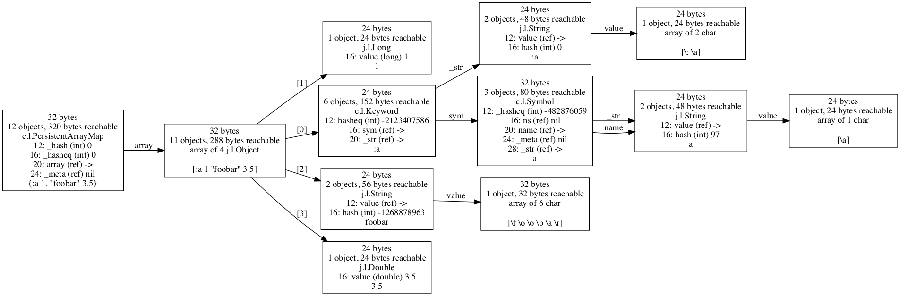

# Introduction

cljol is specific to Clojure on Java.  It uses a JVM library that
knows deep internal details of the JVM, and those parts would need to
be replaced with something else in order to work on a non-JVM
platform.

cljol uses the [Java Object
Layout](https://openjdk.java.net/projects/code-tools/jol) library to
determine the precise size of a Java object, and all of the objects
that it references, either directly, or by following a chain of
references through multiple Java objects.

It can create images of these graphs, either popping up a window using
the `view` function, or writing to a GraphViz dot file using the
`write-dot-file` function.

`cljol` has been tested most with Clojure 1.10.1 so far, but as far as
I know should work fine with Clojure 1.5.1 or later.


# Quick example

You must install [GraphViz](http://www.graphviz.org) in order for the
generation of figures to work -- see its home page for downloads and
installation instructions if the following do not work:

* Ubuntu Linux - `sudo apt-get install graphviz`
* Mac OS X
  * If you use Homebrew: `brew install graphviz`
  * If you use MacPorts: `sudo port install graphviz`

There are not yet any packaged releases of `cljol` on Clojars.  You
can clone the repository yourself and create a JAR if you like, or use
the `clj` / `clojure` commands provided by the Clojure installer.

```bash
$ clj -Sdeps '{:deps {cljol {:git/url "https://github.com/jafingerhut/cljol" :sha "dfd6ad92214424cfab936c26ee4b5a3b8c6f65bf"}}}'
```

In the REPL:

```
(require '[cljol.dig9 :as d])
(def my-map {:a 1 "foobar" 3.5})
(d/view my-map)
(d/write-dot-file my-map "my-map.dot")
(d/write-drawing-file my-map "my-map.pdf" :pdf)
```

See the "Warning messages" section below for messages that you are
likely to see when using this code.

Graphviz dot files are a fairly simple text file format you can read
in any text editor, and convert to many other graphic formats.  You
need not use the commands below to create these other formats, as the
example of creating a PDF format file above shows, but below are some
sample commands you can run in a shell to do this conversion:

```bash
$ dot -Tpdf my-map.dot -o my-map.pdf
$ dot -Tpng my-map.dot -o my-map.png
```

Below is the figure in the file `my-map.png` I get from the last
command above.

Each rectangle is a Java object.  By default each shows:

* the object's size
* the number of objects reachable from that object, via following a
  path of references starting from that object, which includes that
  object itself.  Also the total size in bytes of all of those
  reachable objects.
* its type, usually a class name, with common prefixes like
  "clojure.lang." replaced with "c.l." and "java.lang." replaced with
  "j.l.".  Java arrays are shown as "array of N `class-name`".
* A sequence of lines, one per field stored in the object.  This is
  all per-instance fields (i.e. not declared static in Java) defined
  for the object's class, and all of its superclasses.  Each is listed
  with:
  * its byte offset from the beginning of the object in memory where
    the field is stored
  * the name of the field
  * its type, in parentheses
  * the value of the field
* All references to other objects only show "ref" as the type.  The
  value of a "ref" field is shown as "nil" if it is a Clojure nil
  value (i.e. Java null), or `->` if the reference is to another
  object -- you may find the actual class of the referenced object by
  following the edge labeled with the field name that leaves the node.
* a string representation of the object's value

The string representation is by default limited to 50 characters, with
" ..." appearing at the end if it was truncated.

The arrows out of an array object are labeled with "[i]", where "i" is
a number that is the array index.  Other labels on edges are the name
of the field in the Java object that the edge comes from.



`cljol` drawing of the objects representing the Clojure map `{:a 1
"foobar" 3.5}`


# Warning messages

Note: I see output like that shown below in my REPL, the first time I
run `view` or `write-dot-file`, at least on Ubuntu 18.04 Linux with
OpenJDK 11 and Clojure 1.10.1.  According to its documentation, the
[Java Object Layout](https://openjdk.java.net/projects/code-tools/jol)
library is "using the Unsafe, JVMTI, and Serviceability Agent (SA)
heavily to decoder the actual object layout, footprint, and
references.  This makes JOL much more accurate than other tools
relying on heap dumps, specification assumptions, etc."  Some of the
calls it is making lead to this.

```
# WARNING: Unable to get Instrumentation. Dynamic Attach failed. You may add this JAR as -javaagent manually, or supply -Djdk.attach.allowAttachSelf
# WARNING: Unable to attach Serviceability Agent. You can try again with escalated privileges. Two options: a) use -Djol.tryWithSudo=true to try with sudo; b) echo 0 | sudo tee /proc/sys/kernel/yama/ptrace_scope
WARNING: An illegal reflective access operation has occurred
WARNING: Illegal reflective access by org.openjdk.jol.util.ObjectUtils (file:/home/jafinger/.m2/repository/org/openjdk/jol/jol-core/0.9/jol-core-0.9.jar) to field java.lang.String.value
WARNING: Please consider reporting this to the maintainers of org.openjdk.jol.util.ObjectUtils
WARNING: Use --illegal-access=warn to enable warnings of further illegal reflective access operations
WARNING: All illegal access operations will be denied in a future release
```

The first 2 lines can be eliminated by using these options when
starting your JVM:

```bash
-Djdk.attach.allowAttachSelf -Djol.tryWithSudo=true
```

For example, when using the `clj` or `clojure` commands:

```bash
$ clj -J-Djdk.attach.allowAttachSelf -J-Djol.tryWithSudo=true
```

The lines starting with "WARNING: An illegal reflective access
operation has occurred" happen when using the JOL library with JDK
version 9 or later.  See
[here](https://clojure.org/guides/faq#illegal_access) for more
details.

Tested with:

* Ubuntu 18.04.2, OpenJDK 11, Clojure 1.10.1
* Ubuntu 18.04.2, Oracle JDK 8, Clojure 1.10.1
* Mac OS X 10.13 High Sierra, Oracle JDK 8, Clojure 1.10.1

It should work with older versions of Clojure, too, but I do not know
how far back it can go.  Probably as far back as Clojure 1.6, in which
this code was originally developed.


# Possible future work

Perhaps some day this library might be enhanced to create nice figures
and/or summary statistics showing how many of these objects are shared
between two Clojure collections.  There is some code in the
`cljol.dig` namespace written with that in mind, but it is at best not
well tested and thus probably contains many errors, if it even runs at
all.

It would be nice if there was a way to cause the edges out of Java
array objects to at least usually be in increasing order of array
index.  Right now they are fairly arbitrary.


## License

Copyright © 2016-2019 Andy Fingerhut

This program and the accompanying materials are made available under the
terms of the Eclipse Public License 2.0 which is available at
http://www.eclipse.org/legal/epl-2.0.
