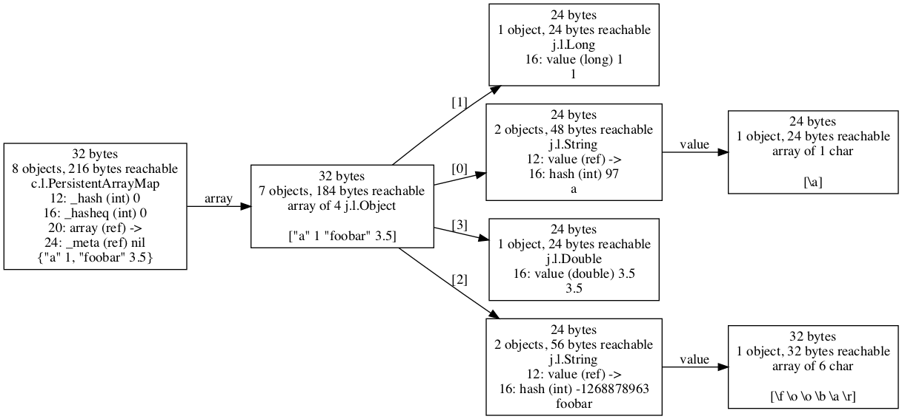

# Introduction

cljol is specific to Clojure on Java.  It uses a JVM library that
knows deep internal details of the JVM, and those parts would need to
be replaced with something else in order to work on a non-JVM
platform.

cljol uses the [Java Object
Layout](https://openjdk.java.net/projects/code-tools/jol) library to
determine the precise size of a Java object, and all of the objects
that it references, either directly, or by following a chain of
references through multiple Java objects.

It can create images of these graphs, either popping up a window using
the `view` function, or writing to a GraphViz dot file using the
`write-dot-file` function.

`cljol` has been tested most with Clojure 1.10.1 so far, but as far as
I know should work fine with Clojure 1.5.1 or later.

See the [gallery](doc/README-gallery.md) for examples of figures
created by this library that demonstrate aspects of the Java VM or
Clojure's implementation that I find interesting.


# Quick example

You must install [GraphViz](http://www.graphviz.org) in order for the
generation of figures to work -- see its home page for downloads and
installation instructions if the following do not work:

* Ubuntu Linux - `sudo apt-get install graphviz`
* Mac OS X
  * If you use Homebrew: `brew install graphviz`
  * If you use MacPorts: `sudo port install graphviz`

There are not yet any packaged releases of `cljol` on Clojars.  You
can clone the repository yourself and create a JAR if you like, or use
the `clj` / `clojure` commands provided by the Clojure installer.

```bash
$ clj -Sdeps '{:deps {cljol {:git/url "https://github.com/jafingerhut/cljol" :sha "a94958663ed350a7eaa350b26413b8b8d682bc06"}}}'
```

In the REPL:

```
(require '[cljol.dig9 :as d])
(def my-map {"a" 1 "foobar" 3.5})

;; Open a new window containing the figure.  Takes a collection of
;; objects.
(d/view [my-map])

;; Write the figure to a Graphviz dot file, or one of many other
;; formats.  I believe you can get a complete list of formats
;; supported by Graphviz by looking at the "device" list in the output
;; of the command "dot -v < /dev/null".

(d/write-dot-file [my-map] "my-map.dot")
(d/write-drawing-file [my-map] "my-map.pdf" :pdf)
```

See the "Warning messages" section below for messages that you are
likely to see when using this code.

Graphviz dot files are a fairly simple text file format you can read
in any text editor, and convert to many other graphic formats.  You
need not use the commands below to create these other formats, as the
example of creating a PDF format file above shows, but below are some
sample commands you can run in a shell to do this conversion:

```bash
$ dot -Tpdf my-map.dot -o my-map.pdf
$ dot -Tpng my-map.dot -o my-map.png
```

Below is the figure in the file `my-map.png` I get from the last
command above.

Each rectangle is a Java object.  The object (or objects) that you
specified to start from are filled with a gray shading.  By default
each rectangle shows:

* the object's size
* the number of objects reachable from that object, via following a
  path of references starting from that object, which includes that
  object itself.  Also the total size in bytes of all of those
  reachable objects.
* either the message "this object in no reference cycles" or "`<number>`
  objects in same SCC with this one".  The first message means that in
  the graph of objects reached from the ones you specified to start
  from, that object is not contained in any cycle of references.  The
  second message means that the object does appear in at least one
  cycle of references, and there are `<number>` objects such that they
  are all in the same SCC, or "strongly connected component", of the
  graph of references.  Two nodes "a" and "b" being in the same SCC
  means that there is a path from "a" to "b", and also a path from "b"
  to "a".
* its type, usually a class name, with common prefixes like
  "clojure.lang." replaced with "c.l." and "java.lang." replaced with
  "j.l.".  Java arrays are shown as "array of N `class-name`".
* A sequence of lines, one per field stored in the object.  This is
  all per-instance fields (i.e. not declared static in Java) defined
  for the object's class, and all of its superclasses.  Each is listed
  with:
  * its byte offset from the beginning of the object in memory where
    the field is stored
  * the name of the field
  * its type, in parentheses
  * the value of the field
* All references to other objects only show "ref" as the type.  The
  value of a "ref" field is shown as "nil" if it is a Clojure nil
  value (i.e. Java null), or `->` if the reference is to another
  object -- you may find the actual class of the referenced object by
  following the edge labeled with the field name that leaves the node.
* a string representation of the object's value, or the message "val
  maybe realizes if str'ed".  If you see that message, it means that
  `cljol` has determined that if it tried to convert the value to a
  string, it might cause lazy sequences to be realized more than they
  already have been before, and it is avoiding this possibility.

The string representation is by default limited to 50 characters, with
" ..." appearing at the end if it was truncated.

The arrows out of an array object are labeled with "[i]", where "i" is
a number that is the array index.  Other labels on edges are the name
of the field in the Java object that the edge comes from.

Immediately below is the `cljol` drawing of the objects representing
the Clojure map `{"a" 1 "foobar" 3.5}`.  In a
`clojure.lang.PersistentArrayMap`, map keys are in even array indices,
and their associated values in the index 1 larger.




# More examples

It does not take much code to create data structures with very large
graphs.  For example, this graph likely has more nodes than you want
to look at:

```
(def v1 (vec (range 1000)))
(d/view [v1])
```

`cljol` includes some code to give you summary statistics about a
graph, and some functions that can produce a subset of a graph, which
you can then display.

The `sum` function takes a collection of objects, creates and returns
a graph representing its objects without drawing it, and prints some
statistics about this graph.  The example below shows that v1's graph
has 1067 objects.  The info near the end shows that 1001 of those have
out-degree 0, where out-degree is the number of edges that leave a
node directed towards another node.  Those 1001 are 'leaf nodes' of
the graph.

```
user=> (def g (d/sum [v1]))

1067 objects
1097 references between them
29480 bytes total in all objects
no cycles
1 weakly connected components found in: 19.503015 msec, 0 gc-count, 0 gc-time-msec
number of nodes in all weakly connected components,
from most to fewest nodes:
(1067)
The scc-graph has 1067 nodes and 1097 edges, took: 24.689886 msec, 0 gc-count, 0 gc-time-msec
The largest size strongly connected components, at most 10:
(1 1 1 1 1 1 1 1 1 1)
number of objects of each size in bytes:
({:size-bytes 16, :num-objects 1, :total-size 16}
 {:size-bytes 24, :num-objects 1032, :total-size 24768}
 {:size-bytes 40, :num-objects 1, :total-size 40}
 {:size-bytes 48, :num-objects 1, :total-size 48}
 {:size-bytes 144, :num-objects 32, :total-size 4608})
number and size of objects of each class:
({:total-size 16,
  :num-objects 1,
  :class "j.u.c.atomic.AtomicReference"}
 {:total-size 40, :num-objects 1, :class "c.l.PersistentVector"}
 {:total-size 768, :num-objects 32, :class "c.l.PersistentVector$Node"}
 {:total-size 4656, :num-objects 33, :class "[Ljava.lang.Object;"}
 {:total-size 24000, :num-objects 1000, :class "j.l.Long"})

1001 leaf objects (no references to other objects)
1 root nodes (no reference to them from other objects _in this graph_)
number of objects of each in-degree (# of references to it):
({:in-degree 0, :num-objects 1}
 {:in-degree 1, :num-objects 1065}
 {:in-degree 32, :num-objects 1})
number of objects of each out-degree (# of references from it):
({:out-degree 0, :num-objects 1001}
 {:out-degree 2, :num-objects 33}
 {:out-degree 8, :num-objects 1}
 {:out-degree 31, :num-objects 1}
 {:out-degree 32, :num-objects 31})
map where keys are distance of an object from a start node,
values are number of objects with that distance:
({:distance 0, :num-objects 1, :total-size 40}
 {:distance 1, :num-objects 2, :total-size 72}
 {:distance 2, :num-objects 10, :total-size 352}
 {:distance 3, :num-objects 31, :total-size 744}
 {:distance 4, :num-objects 31, :total-size 4464}
 {:distance 5, :num-objects 992, :total-size 23808})
#'user/g
```

Here is a way to create another graph `g2` from `g` with all of `g`'s
leaves removed, and then draw `g2`:

```
(require '[ubergraph.core :as uber]
         '[cljol.graph :as gr])

(def g2 (uber/remove-nodes* g (gr/leaf-nodes g)))

(d/view-graph g2)
```

Below we demonstrate keeping only those nodes that are within at most
distance 3 of the starting objects given when creating the graph.
That is, the Java object is reachable from one of the starting objects
in 3 or fewer 'hops'.

```
(def g3 (gr/induced-subgraph g (filter #(<= (uber/attr g % :distance) 3)
                                        (uber/nodes g))))

(d/view-graph g3)
```

These graphs `g`, `g2`, and `g3` are all created using the
[Ubergraph](https://github.com/Engelberg/ubergraph) library.  All of
its features are available for manipulating these graphs.  The drawing
functions use keys in the node and edge attribute maps to affect some
aspects of the drawings, e.g. the `:label` key is used to generate the
labels.

Another thing that can be interesting to see is the fraction of
objects shared between a persistent collection, and the persistent
collection created by making a small change to the first collection.

```
(def v1 (vec (range 5)))
(def v2 (conj v1 5))
(def g (d/sum [v1 v2]))

;; Create a graph from g, different because of some additional
;; attributes added to the nodes by the function
;; add-attributes-by-reachability

;; Any node reachable ":only-from" object v1 will have its attributes
;; augmented by adding the `:color "red"`.  Any node reachable only
;; from object v2 will have color green.  Any node reachable from more
;; than one root node will be blue, and any reachable from no root
;; will be colored gray.

(def g2 (d/add-attributes-by-reachability g
         [{:only-from v1
           :attrs {:color "red"}}
          {:only-from v2
           :attrs {:color "green"}}
          {:from-multiple true
           :attrs {:color "blue"}}
          {:from-none true
           :attrs {:color "gray"}}]))

(d/view-graph g2)
(d/view-graph g2 {:save {:filename "g2.pdf" :format :pdf}})
```


# Warning messages

Note: I see output like that shown below in my REPL, the first time I
run `view` or `write-dot-file`, at least on Ubuntu 18.04 Linux with
OpenJDK 11 and Clojure 1.10.1.  According to its documentation, the
[Java Object Layout](https://openjdk.java.net/projects/code-tools/jol)
library is "using the Unsafe, JVMTI, and Serviceability Agent (SA)
heavily to decoder the actual object layout, footprint, and
references.  This makes JOL much more accurate than other tools
relying on heap dumps, specification assumptions, etc."  Some of the
calls it is making lead to this.

```
# WARNING: Unable to get Instrumentation. Dynamic Attach failed. You may add this JAR as -javaagent manually, or supply -Djdk.attach.allowAttachSelf
# WARNING: Unable to attach Serviceability Agent. You can try again with escalated privileges. Two options: a) use -Djol.tryWithSudo=true to try with sudo; b) echo 0 | sudo tee /proc/sys/kernel/yama/ptrace_scope
WARNING: An illegal reflective access operation has occurred
WARNING: Illegal reflective access by org.openjdk.jol.util.ObjectUtils (file:/home/jafinger/.m2/repository/org/openjdk/jol/jol-core/0.9/jol-core-0.9.jar) to field java.lang.String.value
WARNING: Please consider reporting this to the maintainers of org.openjdk.jol.util.ObjectUtils
WARNING: Use --illegal-access=warn to enable warnings of further illegal reflective access operations
WARNING: All illegal access operations will be denied in a future release
```

I have used `cljol` successfully even when these warning messages
appear, so you need not change anything if you do not mind seeing the
messages.  If you do want to eliminate the first 2 lines, you may use
these options when starting your JVM:

```bash
-Djdk.attach.allowAttachSelf -Djol.tryWithSudo=true
```

For example, when using the `clj` or `clojure` commands:

```bash
$ clj -J-Djdk.attach.allowAttachSelf -J-Djol.tryWithSudo=true
```

The lines starting with "WARNING: An illegal reflective access
operation has occurred" happen when using the JOL library with JDK
version 9 or later.  See
[here](https://clojure.org/guides/faq#illegal_access) for more
details.

Tested with:

* Ubuntu 18.04.2, OpenJDK 11, Clojure 1.10.1
* Ubuntu 18.04.2, Oracle JDK 8, Clojure 1.10.1
* Mac OS X 10.13 High Sierra, Oracle JDK 8, Clojure 1.10.1

It should work with older versions of Clojure, too, but I do not know
how far back it can go.  Probably as far back as Clojure 1.6, in which
this code was originally developed.


# Possible future work

Perhaps some day this library might be enhanced to create nice figures
and/or summary statistics showing how many of these objects are shared
between two Clojure collections.  There is some code in the
`cljol.dig` namespace written with that in mind, but it is at best not
well tested and thus probably contains many errors, if it even runs at
all.

It would be nice if there was a way to cause the edges out of Java
array objects to at least usually be in increasing order of array
index.  Right now they are fairly arbitrary.


## License

Copyright © 2016-2019 Andy Fingerhut

This program and the accompanying materials are made available under the
terms of the Eclipse Public License 2.0 which is available at
http://www.eclipse.org/legal/epl-2.0.
