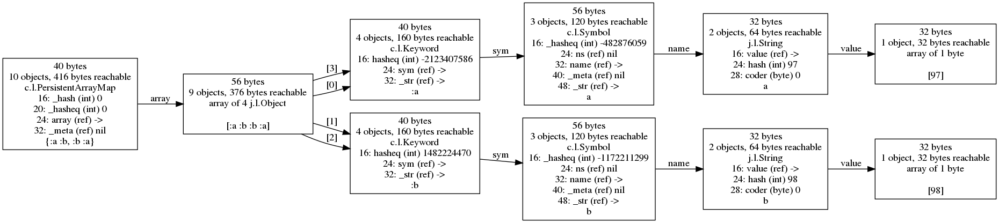

# Compressed pointers in 64-bit JVMs

In looking at several of these figures, you may have noticed that the
byte offsets of the fields only differ by 4 between most fields, even
for references.  Those references should be pointers between Java
objects in memory.  So why are they only 4 bytes long?  Shouldn't they
be 8 bytes in size, to hold a 64-bit address, on a 64-bit JVM?

They are actually only taking up 4 bytes of storage, due to a memory
optimization in most JVMs called "Compressed Pointers".  [Here is one
article](https://www.baeldung.com/jvm-compressed-oops) describing them
in more detail.

The basic idea is that because JVM memory allocation always aligns the
starting address of objects to be multiples of 8 bytes, the least
significant 3 bits of all memory addresses are 0.  If you specify a
maximum heap size of (8 * 4 GBytes) = 32 GBytes or less when starting
the JVM, all 64-bit addresses can be shifted right by 3 bit positions,
and the result will always fit within 32 bits, with no loss of
information.

I have used the `-XX:-UseCompressedOops` option of the JVM to disable
this option, and you can see the difference in results below.

The next figure below shows

between
when compressed pointers are enabled, which is by default since JDK 7,
or disabled via the command line option.

# Compact strings in Java 9 and later

In Java 8 and earlier, the default was for strings to be represented
in memory as arrays of Java `char`, which are 2 bytes each.  If most
of the strings you represent are within the ASCII subset, then this is
twice as much memory as they need, but it enables strings to be
handled consistently throughout the Java library whether they use a
larger subset of the full Unicode character set, or not.

Java 9 introduced [Compact
strings](https://www.codenuclear.com/compact-strings-java-9), where if
a string contains only characters whose code points fit within a
single 8-bit byte, then it is stored in memory using only 1 byte per
character.

`cljol` can make this easy to see, by using it to analyze a string
like `"food has only 8-bit characters"` containing exactly 30
characters, all within the ASCII subset, and a another string like
`"f\u1234od has non-8-bit characters!"` that also contains exactly 30
characters, but one of them requires more than 8 bits to represent its
Unicode code point -- it is the one represented using Java and
Clojure/Java's `\u1234` syntax, which means a single character with
code point of 1234 hexadecimal.

Examine the first figure below, generated using JDK 1.8.0_192.  Notice
that both strings have a reference to an array of 30 Java chars, where
each of those chars take 2 bytes of storage:

Now look at the similar figure below, generated using JDK 9.0.4.  The
string that contains only 8-bit characters has a reference to an array
of 30 bytes, whereas the string that has a character that cannot be
represented in 8 bits has a reference to an array of 60 bytes.  The
Java library stores the difference in the array encoding via the field
`coder` in the object of type `java.lang.String` that references the
byte array.

