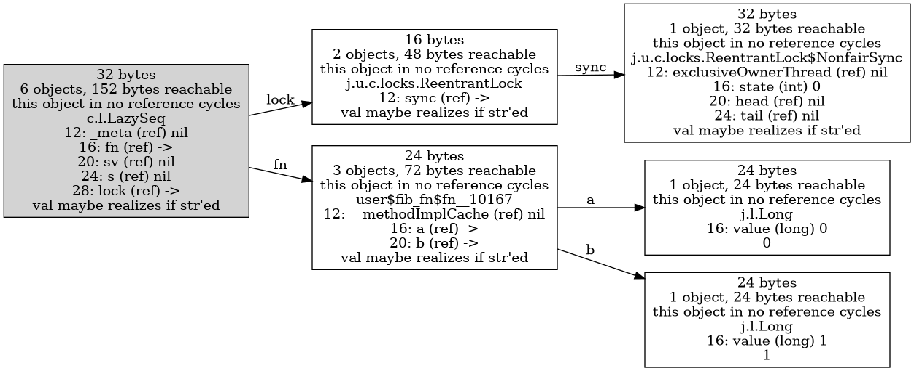
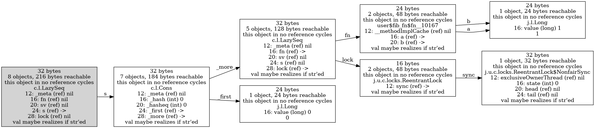
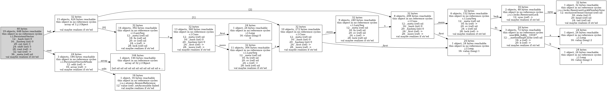
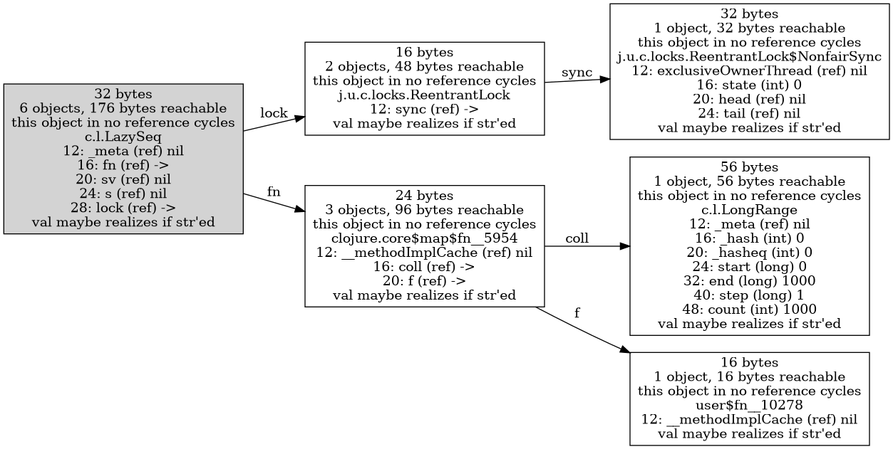
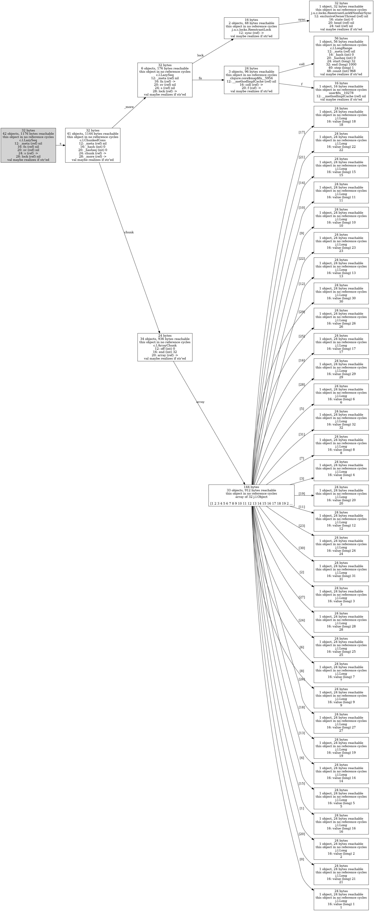
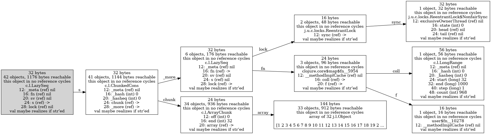
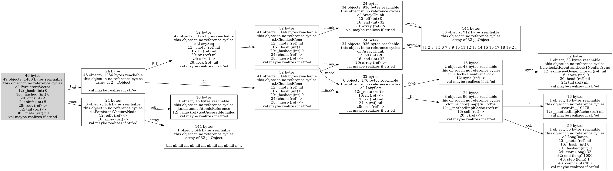
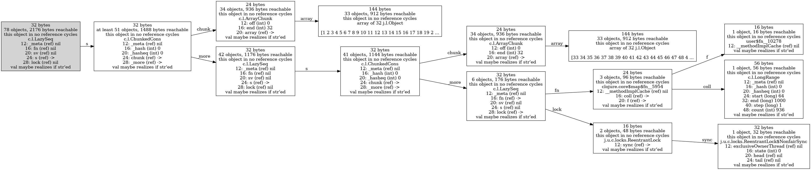
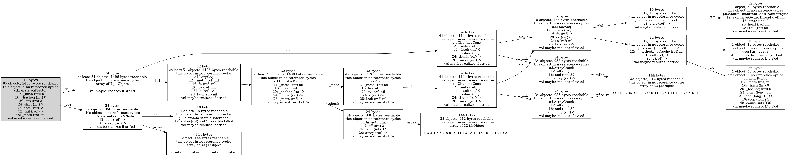

If you are reading this via Github's web site, you can click on any of
the figures and it will show it on a page zoomed in to a larger size.
This zoomed in image allows you to scroll up, down, left, and right
within it.


# Lazy sequences realized one element at a time

For this example, it is important to configure `cljol` so that it does
_not_ show the value of objects as a label on the nodes.  If you try
to view such graphs with the default `cljol` behavior of labeling
nodes with strings representing the object's value, it will try to
realize the lazy sequence, which _changes the objects_.  In this
particular example, it will also go into an infinite loop trying to
realize an infinite lazy sequence.

You can configure the contents of the node labels by giving a sequence
of functions as the value associated with the key
`:node-label-functions` in a map of options passed to most of the
`cljol` functions.

Here is the default list of functions used to create node labels if
you do not provide an options map, copied from the code in the
`cljol.dig9` namespace:

```
(def default-node-labels
  [;;address-hex
   size-bytes
   total-size-bytes
   class-description
   field-values
   ;;path-to-object
   javaobj->str])
```

We will use this options map for the examples in this section.  Note
that we leave out `javaobj->str`:

```
(require '[cljol.dig9 :as d])

(def opts {:node-label-functions
  [d/size-bytes
   d/total-size-bytes
   d/class-description
   d/field-values]})
```

We will use the following function to create and return a lazy
sequence, one element at a time, with no 'chunking' optimization that
several buit-in Clojure functions use (see the next section for
examples of that):

```
;; We use +' instead of + in case you want to experiment on your own
;; with taking over about 92 elements from the sequence, when a 64-bit
;; long integer overflows.

(defn fib-fn [a b]
  (lazy-seq (cons a (fib-fn b (+' a b)))))
```

Here are the first 15 elements of the sequence it returns:

```
(take 15 (fib-fn 0 1))
;; (0 1 1 2 3 5 8 13 21 34 55 89 144 233 377)
```

Time to make some drawings.  First, what the objects created look like
before any elements of the sequence have been generated.

```
(def fib-seq (fib-fn 0 1))

(d/view [fib-seq] opts)
(d/write-dot-file [fib-seq] "lazy-fib-seq-unrealized.dot" opts)
```


Now force the first element of the sequence to be generated.
```
(println (take 1 fib-seq))
(d/view [fib-seq] opts)
(d/write-dot-file [fib-seq] "lazy-fib-seq-realized1.dot" opts)
```


Note that the leftmost object is the _same object_ as the leftmost
object in the previous figure, but now its field `fn` has been changed
from pointing at a Clojure function object, to nil, and its field `s`
has changed from nil to a `Cons` object.  That `Cons` object has a
`_first` field pointing to the first element of the sequence, 0, and a
`_more` field pointing to another `LazySeq` object, which points at a
Clojure function object.

That function object will be called when we force the second element
of the sequence to be realized, as we do next.

```
(println (take 2 fib-seq))
(d/view [fib-seq] opts)
(d/write-dot-file [fib-seq] "lazy-fib-seq-realized2.dot" opts)
```


The leftmost object has not changed from the previous figure to the
one above, but the second `LazySeq` object has, from pointing at a
function with its `fn` field, to pointing at a new `Cons` object with
its `s` field.

Below we view a vector of the head of the sequence, but also the
sequence starting at the second element `(nthrest fib-seq 1)`, and the
sequence starting at the third element `(nthrest fib-seq 2)`, so you
can see explict pointers in the figure to those parts of the lazy
sequence.  Look for the object with three pointers out of it labeled
`[0]`, `[1]`, and `[2]`.

```
(d/view [[fib-seq (nthrest fib-seq 1) (nthrest fib-seq 2)]] opts)
(d/write-dot-file [[fib-seq (nthrest fib-seq 1) (nthrest fib-seq 2)]]
    "lazy-fib-seq-vector-of-nthrest.dot" opts)
```



# Chunked lazy sequences

While there are some lazily realized sequences in Clojure that look
like the one demonstrated in the previous section, a fairly large
number of them take advantage of a 'chunked' implementation.  The
basic idea is to reduce the number of objects and pointers that must
be followed for long sequences, by creating 'chunk' objects that
contain pointers to up to 32 consecutive elements.  This not only
saves memory, but also improves performance, in part because it takes
advantage of locality of reference in processor caches -- once one
part of an array of 32 pointers is brought into the cache and
referenced, some or all of the rest of them are brought into the
cache, too.

We will use the same options mentioned in the previous section to
avoid printing the value of objects in their node labels, to avoid the
act of creating a graph from causing more of a sequence to be
realized.

```
(require '[cljol.dig9 :as d])

(def opts {:node-label-functions
  [d/size-bytes
   d/total-size-bytes
   d/class-description
   d/field-values]})
```

The `range` function returns a chunked sequence, and the `map`
function has special code in its implementation that recognizes when
the sequence it is given is chunked, and to take advantage of this and
preserve its 'chunked-ness' in the sequence it returns.

The function given as a first argument to `map` would not normally
have a `println` call in it.  It is included to make it obvious
exactly when the function is called on each element.

The first figure we draw is before any elements of the sequence are
realized, so the data structures are relatively small.
```
(def chunked-seq (map (fn [x]
                       (println "processing element:" x)
                       (inc x))
                      (range 1000)))

(d/view [chunked-seq] opts)
(d/write-dot-file [chunked-seq] "chunked-seq-unrealized.dot" opts)
```


Next we force exactly one element of the sequence to be realized, so
we can print it.  Because of the chunked nature of the sequence, this
causes not only one element to be realized but the first 32, as you
can tell from the `println` printing 32 "processing element:" lines of
output.  The figure also shows that all of the first 32 elements have
been realized.

```
(println (take 1 chunked-seq))
;; => (1)
;; prints "processing element: 0" through "processing element: 31"
;; output lines, from processing one entire chunk.

(d/view [chunked-seq] opts)
(d/write-dot-file [chunked-seq] "chunked-seq-realized1.dot" opts)
```


Because the graph above is already quite large, mostly due to the 32
`java.lang.Long` objects, let us draw the graph where all nodes for an
object with type `java.lang.Long` are removed.  We will make a
function that does this, because I want to do this for creating
several later graphs, too.
```
(require '[ubergraph.core :as uber])
(defn graph-no-longs [obj-coll fname opts]
  (let [g (d/sum obj-coll opts)
        g2 (uber/remove-nodes*
	     g (filter (fn [n] (instance? Long (uber/attr g n :obj)))
                       (uber/nodes g)))]
    (d/view-graph g2)
    (d/view-graph g2 {:save {:filename fname :format :dot}})))

(graph-no-longs [chunked-seq] "chunked-seq-realized1-no-longs.dot" opts)
```


Note that the node label strings, including the number and bytes of
objects reachable from a node, are calculated on the full graph by the
`d/sum` function, and the code above does nothing to recalculate the
labels after other nodes are removed.  As long as you understand this
is happening, that may be exactly what you want -- a smaller graph
with some summary information about what is not included.

Next we print the first 20 elements of the sequence.  No more
`println` calls execute, because the first 32 elements were already
realized above.  We show a drawing that is the same as the previous
one, except it also has a vector where the second element is the
return value of `(nthrest chunked-seq 20)`, so you can see the object
that creates and returns.
```
(println (take 20 chunked-seq))
;; => (1 2 3 4 5 6 7 8 9 10 11 12 13 14 15 16 17 18 19 20)
;; no more "processing element:" lines printed, because the
;; first 32 elements have already been realized above.

(graph-no-longs [[chunked-seq (nthrest chunked-seq 20)]] "chunked-seq-and-nthrest-20-realized20.dot" opts)
```


Printing the first 32 elements again causes no new elements of the
sequence to be realized.  Printing the first 33 causes the 33rd
through 64th elements to be realized, as the `println` output
indicates.
```
(println (take 32 chunked-seq))
;; no "processing element:" lines printed for this either

(println (take 33 chunked-seq))
;; => (1 2 3 4 5 6 7 8 9 10 11 12 13 14 15 16 17 18 19 20 21 22 23 24 25 26 27 28 29 30 31 32 33)
;; prints "processing element: 32" through "processing element: 63"
;; output lines, from processing the second chunk

(graph-no-longs [chunked-seq] "chunked-seq-realized33.dot" opts)
```


```
(graph-no-longs [[chunked-seq (nthrest chunked-seq 40)]] "chunked-seq-and-nthrest-40-realized33.dot" opts)
```



# Compressed pointers in 64-bit JVMs

In looking at these figures, you may have noticed that the byte
offsets of the fields only differ by 4 between most fields, even for
references.  Those references should be pointers between Java objects
in memory.  So why are they only 4 bytes long?  When you are running a
64-bit JVM, shouldn't they be 8 bytes in size, to hold a 64-bit
address?

In most cases, they are only taking up 4 bytes of storage, due to a
memory optimization in most JVMs called "Compressed Pointers".  [Here
is one article](https://www.baeldung.com/jvm-compressed-oops)
describing them in more detail.

The basic idea is that because JVM memory allocation always aligns the
starting address of objects to be multiples of 8 bytes, the least
significant 3 bits of all memory addresses are 0.  If you specify a
maximum heap size of (8 * 4 GBytes) = 32 GBytes or less when starting
the JVM, all 64-bit addresses can be shifted right by 3 bit positions,
and the result will always fit within 32 bits, with no loss of
information.

I have used the `-XX:-UseCompressedOops` option of the JVM to disable
this option, and you can see the difference in results below.

The next figure below shows the results with the default JVM behavior
where compressed pointers are enabled.  I have read that this is the
default behavior since Java 7, when the max heap size is 32 GBytes or
less.  The leftmost object with type `PersistentArrayMap` has field
`array` starting at offset 20 bytes from the beginning of the object,
and it is a reference.  The next field starts at offset 24 bytes, so
`array` only occupies 4 bytes.

Other examples include the `value` field in the two objects with type
`String`.


The next figure below shows the results with compressed pointers
disabled via the `-XX:-UseCompressedOops` command line option when
starting the JVM.

Here the field `array` in the leftmost object has offset 24, and the
immediately following field has offset 32, so `array` occupies 8
bytes.  Similarly for the size of the `value` fields of the objects
with type `String`.

No offsets are shown for each array element in the object with type
`array of 4 j.l.Object`, but you can see that it occupies 56 bytes
total, whereas in the previous figure it only occupied 32 bytes.

Another difference to note is that the minimum offset of any field in
this figure is 16 bytes, whereas several fields in the figure above
start at offset 12 bytes.  I believe that the common "header" fields
at the beginning of every object in the JVM include a reference that
is not shown in these figures, and this is also 8 bytes instead of 4
bytes when compressed pointers are disabled.


# JVM object headers

I will not try here to explain what the contents of the headers of
each Java object are.  According to the article [What Heap Dumps Are
Lying To You About](https://shipilev.net/blog/2014/heapdump-is-a-lie),
it is dependent upon the developer of the JVM, e.g. Hotspot can be
different than Azul Zing, which can be different than yet another
vendor.  It can depend upon whether compressed pointers are enabled or
disabled, and perhaps other factors.  I will say that sizes I have
commonly seen are 12 or 16 bytes.

The example output below was obtained running this version of the JVM
on an Ubuntu 18.04 Linux system, on x86_64 processor architecture.

```
$ java -version
openjdk version "11.0.3" 2019-04-16
OpenJDK Runtime Environment (build 11.0.3+7-Ubuntu-1ubuntu218.04.1)
OpenJDK 64-Bit Server VM (build 11.0.3+7-Ubuntu-1ubuntu218.04.1, mixed mode)
```

Sample output showing contents of object headers with compressed
pointers enabled:
```
user=> (print (d/class-layout->str ""))
java.lang.String object internals:
 OFFSET  SIZE     TYPE DESCRIPTION                               VALUE
      0     4          (object header)                           31 00 00 00 (00110001 00000000 00000000 00000000) (49)
      4     4          (object header)                           00 00 00 00 (00000000 00000000 00000000 00000000) (0)
      8     4          (object header)                           da 02 00 20 (11011010 00000010 00000000 00100000) (536871642)
     12     4   char[] String.value                              []
     16     4      int String.hash                               0
     20     4          (loss due to the next object alignment)
Instance size: 24 bytes
Space losses: 0 bytes internal + 4 bytes external = 4 bytes total
```

and again with compressed pointers disabled:
```
user=> (print (d/class-layout->str ""))
java.lang.String object internals:
 OFFSET  SIZE     TYPE DESCRIPTION                               VALUE
      0     4          (object header)                           01 00 00 00 (00000001 00000000 00000000 00000000) (1)
      4     4          (object header)                           00 00 00 00 (00000000 00000000 00000000 00000000) (0)
      8     4          (object header)                           c0 df 3f 28 (11000000 11011111 00111111 00101000) (675274688)
     12     4          (object header)                           dc 7f 00 00 (11011100 01111111 00000000 00000000) (32732)
     16     8   char[] String.value                              []
     24     4      int String.hash                               0
     28     4          (loss due to the next object alignment)
Instance size: 32 bytes
Space losses: 0 bytes internal + 4 bytes external = 4 bytes total
```


# Compact strings in Java 9 and later

In Java 8 and earlier, the default was for strings to be represented
in memory as arrays of Java `char`, which are 2 bytes each.  If most
of the strings you represent are within the ASCII subset, then this is
twice as much memory as they need, but it enables strings to be
handled consistently throughout the Java library whether they use a
larger subset of the full Unicode character set, or not.

Java 9 introduced [Compact
strings](https://www.codenuclear.com/compact-strings-java-9), where if
a string contains only characters whose code points fit within a
single 8-bit byte, then it is stored in memory using only 1 byte per
character.

`cljol` can make this easy to see, by using it to analyze a string
like `"food has only 8-bit characters"` containing exactly 30
characters, all within the ASCII subset, and another string like
`"f\u1234od has non-8-bit characters!"` that also contains exactly 30
characters, but one of them requires more than 8 bits to represent its
Unicode code point -- it is the one represented using Java and
Clojure/Java's `\u1234` syntax, which means a single character with
code point of 1234 hexadecimal.

Examine the first figure below, generated using JDK 1.8.0_192.  Notice
that both strings have a reference to an array of 30 Java chars, where
each of those chars take 2 bytes of storage:


Now look at the similar figure below, generated using JDK 9.0.4.  The
string that contains only 8-bit characters has a reference to an array
of 30 bytes, whereas the string that has a character that cannot be
represented in 8 bits has a reference to an array of 60 bytes.  The
Java library stores the difference in the array encoding via the field
`coder` in the object of type `java.lang.String` that references the
byte array.


# Different ways of holding vectors of numbers in Clojure

How much memory do these data structures require?

```
(def vec10 (vec (range 10)))
(def unboxed-vec10 (apply vector-of :long (range 10)))
;; This is a mutable Java array, so a significantly different set of
;; operations supported on them, especially because of mutability.
(def arr10 (long-array (range 10)))
```

Let's take a look at the small ones in figure form, then try out much
larger ones with summary statistics only, since the figures get pretty
large.

```
(require '[cljol.dig9 :as d])
(d/view [vec10])
```

```
(d/view [unboxed-vec10])
```

```
(d/view [arr10])
```


Every Long integer requires 8 bytes of storage, so 1000 longs requires
at least 8,000 bytes.  What is the average overhead for using these
different data structures?

```
(def vec1000 (vec (range 1000)))
(def g (d/sum [vec1000]))
;; 1067 objects, 29,480 total bytes
(/ 29480.0 (* 8 1000))
;; 3.685 times more than the long values themselves

(def unboxed-vec1000 (apply vector-of :long (range 1000)))
(def g (d/sum [unboxed-vec1000]))
;; 67 objects, 9,480 total bytes
(/ 9480.0 (* 8 1000))
;; 1.185 times more than the long values themselves

(def arr1000 (long-array (range 1000)))
(def g (d/sum [arr1000]))
;; 1 object, 8,016 total bytes
(/ 8016.0 (* 8 1000))
;; 1.002 times more than the long values themselves
```
